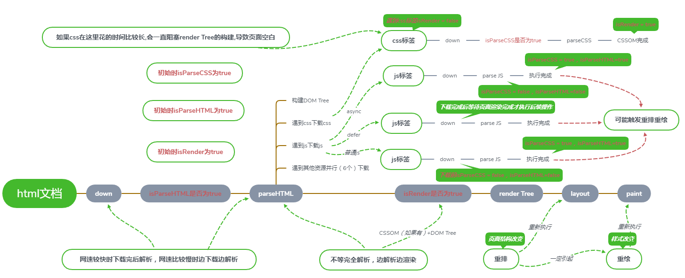

# 二、浏览器运行机制
## 1.浏览器解析HTML过程

渲染引擎根据 HTML 文件描述构建相应的数学模型，调用浏览器各个零部件，从而将网页资源代码转换为图像结果，这个过程就是渲染过程（如下图）。


从这个流程来看，浏览器呈现网页这个过程，宛如一个黑盒。在这个神秘的黑盒中，有许多功能模块，内核内部的实现正是这些功能模块相互配合协同工作进行的。其中我们最需要关注的，就是**HTML 解释器**、**CSS 解释器**、**图层布局计算模块**、**视图绘制模块**与**JavaScript 引擎**这几大模块：

- HTML 解释器：将 HTML 文档经过词法分析输出 DOM 树。
- CSS 解释器：解析 CSS 文档, 生成样式规则。
- 图层布局计算模块：布局计算每个对象的精确位置和大小。
- 视图绘制模块：进行具体节点的图像绘制，将像素渲染到屏幕上。
- JavaScript 引擎：编译执行 Javascript 代码。

浏览器渲染过程解析

### 解析 HTML
在这一步浏览器执行了所有的加载解析逻辑，在解析 HTML 的过程中发出了页面渲染所需的各种外部资源请求。
解析 HTML 以创建的是 DOM 树（DOM tree ）：渲染引擎开始解析 HTML 文档，转换树中的标签到 DOM 节点，它被称为“内容树”
### 解析 CSS
解析 CSS（包括外部 CSS 文件和样式元素）创建的是 CSSOM 树。CSSOM 的解析过程与 DOM 的解析过程是并行的
### 解析 JS
### 渲染树
CSSOM 与 DOM 结合，之后我们得到的就是渲染树（Render tree ）
### 计算图层布局
从根节点递归调用，计算每一个元素的大小、位置等，给每个节点所应该出现在屏幕上的精确坐标，我们便得到了基于渲染树的布局渲染树（Layout of the render tree）
### 绘制图层
在这一步中浏览器会根据我们的 DOM 代码结果，把每一个页面图层转换为像素，并对所有的媒体文件进行解码。
## 2.阻塞

说完了过程，我们来说一说特性。

HTML、CSS 和 JS，都具有**阻塞渲染**的特性。

HTML 阻塞，天经地义——没有 HTML，何来 DOM？没有 DOM，渲染和优化，都是空谈。

那么 CSS 和 JS 的阻塞又是怎么回事呢？

### 1.CSS 的阻塞

在刚刚的过程中，我们提到 DOM 和 CSSOM 合力才能构建渲染树。这一点会给性能造成严重影响：默认情况下，CSS 是阻塞的资源。浏览器在构建 CSSOM 的过程中，**不会渲染任何已处理的内容**。即便 DOM 已经解析完毕了，只要 CSSOM 不 OK，那么渲染这个事情就不 OK（这主要是为了避免没有 CSS 的 HTML 页面丑陋地“裸奔”在用户眼前）。

我们知道，只有当我们开始解析 HTML 后、解析到 link 标签或者 style 标签时，CSS 才登场，CSSOM 的构建才开始。很多时候，DOM 不得不等待 CSSOM。因此我们可以这样总结：

> CSS 是阻塞渲染的资源。需要将它尽早、尽快地下载到客户端，以便缩短首次渲染的时间。

事实上，现在很多团队都已经做到了尽早（将 CSS 放在 head 标签里）和尽快（启用 CDN 实现静态资源加载速度的优化）。这个“把 CSS 往前放”的动作，对很多同学来说已经内化为一种编码习惯。那么现在我们还应该知道，这个“习惯”不是空穴来风，它是由 CSS 的特性决定的。

### 2.JS 的阻塞

不知道大家注意到没有，前面我们说过程的时候，花了很多笔墨去说 HTML、说 CSS。相比之下，JS 的出镜率也太低了点。  
这当然不是因为 JS 不重要。而是因为，在首次渲染过程中，JS 并不是一个非登场不可的角色——没有 JS，CSSOM 和 DOM 照样可以组成渲染树，页面依然会呈现——即使它死气沉沉、毫无交互。

JS 的作用在于**修改**，它帮助我们修改网页的方方面面：内容、样式以及它如何响应用户交互。这“方方面面”的修改，本质上都是对 DOM 和 CSSDOM 进行修改。因此 JS 的执行会阻止 CSSOM，在我们不作显式声明的情况下，它也会阻塞 DOM。

我们通过一个 🌰 来理解一下这个机制：
```html
<!DOCTYPE html>
<html lang="en">
<head>
  <meta charset="UTF-8">
  <meta name="viewport" content="width=device-width, initial-scale=1.0">
  <meta http-equiv="X-UA-Compatible" content="ie=edge">
  <title>JS阻塞测试</title>
  <style>
    #container {
      background-color: yellow;
      width: 100px;
      height: 100px;
    }
  </style>
  <script>
    // 尝试获取container元素
    var container = document.getElementById("container")
    console.log('container', container)
  </script>
</head>
<body>
  <div id="container"></div>
  <script>
    // 尝试获取container元素
    var container = document.getElementById("container")
    console.log('container', container)
    // 输出container元素此刻的背景色
    console.log('container bgColor', getComputedStyle(container).backgroundColor)
  </script>
  <style>
    #container {
      background-color: blue;
    }
  </style>
</body>
</html>
```

三个 console 的结果分别为：


注：本例仅使用了内联 JS 做测试。感兴趣的同学可以把这部分 JS 当做外部文件引入看看效果——它们的表现一致。

第一次尝试获取 id 为 container 的 DOM 失败，这说明 JS 执行时阻塞了 DOM，后续的 DOM 无法构建；第二次才成功，这说明脚本块只能找到在它前面构建好的元素。这两者结合起来，“阻塞 DOM”得到了验证。再看第三个 console，尝试获取 CSS 样式，获取到的是在 JS 代码执行前的背景色（yellow），而非后续设定的新样式（blue），说明 CSSOM 也被阻塞了。那么在阻塞的背后，到底发生了什么呢？

我们前面说过，**JS 引擎是独立于渲染引擎存在的**。我们的 JS 代码在文档的何处插入，就在何处执行。当 HTML 解析器遇到一个 script 标签时，它会暂停渲染过程，将控制权交给 JS 引擎。JS 引擎对内联的 JS 代码会直接执行，对外部 JS 文件还要先获取到脚本、再进行执行。等 JS 引擎运行完毕，浏览器又会把控制权还给渲染引擎，继续 CSSOM 和 DOM 的构建。 因此与其说是 JS 把 CSS 和 HTML 阻塞了，不如说是 JS 引擎抢走了渲染引擎的控制权。

现在理解了阻塞的表现与原理，我们开始思考一个问题。浏览器之所以让 JS 阻塞其它的活动，是因为它不知道 JS 会做什么改变，担心如果不阻止后续的操作，会造成混乱。但是我们是写 JS 的人，我们知道 JS 会做什么改变。假如我们可以确认一个 JS 文件的执行时机并不一定非要是此时此刻，我们就可以通过对它使用 defer 和 async 来避免不必要的阻塞，这里我们就引出了外部 JS 的三种加载方式。

### 3.JS 的三种加载方式

- 正常模式：
  ```js
  <script src="index.js"></script>
  ```
这种情况下 JS 会阻塞浏览器，浏览器必须等待 index.js 加载和执行完毕才能去做其它事情。

- async 模式：
  ```js
  <script async src="index.js"></script>
  ```
async 模式下，JS 不会阻塞浏览器做任何其它的事情。它的加载是异步的，当它加载结束，JS 脚本会**立即执行**。
- defer 模式：
  ```js
  <script defer src="index.js"></script>
  ```
defer 模式下，JS 的加载是异步的，执行是**被推迟的**。等整个文档解析完成、DOMContentLoaded 事件即将被触发时，被标记了 defer 的 JS 文件才会开始依次执行。

从应用的角度来说，一般当我们的脚本与 DOM 元素和其它脚本之间的依赖关系不强时，我们会选用 async；当脚本依赖于 DOM 元素和其它脚本的执行结果时，我们会选用 defer。

通过审时度势地向 script 标签添加 async/defer，我们就可以告诉浏览器在等待脚本可用期间不阻止其它的工作，这样可以显著提升性能。
